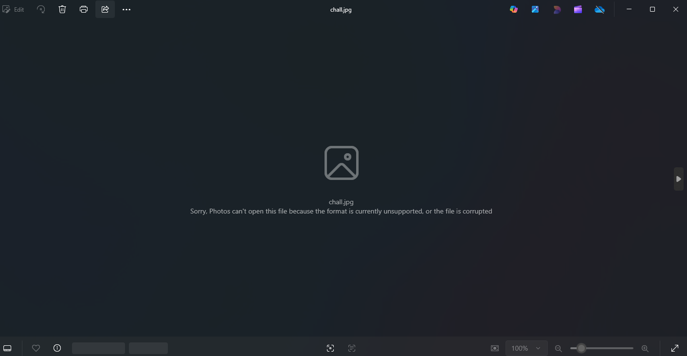
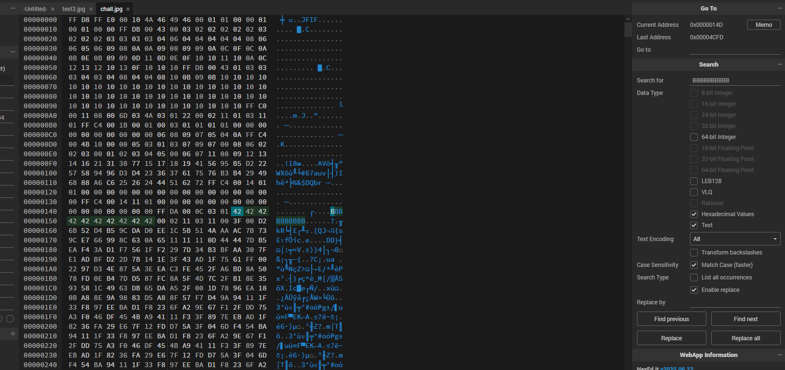
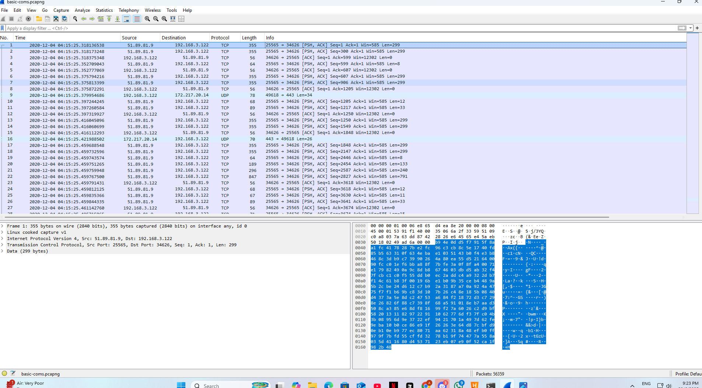

# Writeup entry-level Forensic

## Table of Contents

### Forensics
1. [Alternating](#alternating)
2. [bbbbbbbbbb](#bbbbbbbbbb)
3. [basic-coms](#basic-coms)

---

### Alternating

### Description
> We have hidden something in the file and I'm sure you won't find it. Make sure to extract the archive using WinRar. Windows is your friend.

`Flag.rar`

---

### Solution

After extracting `Flag.rar` using WinRAR as instructed, I found an empty file named **Flag.txt.txt**.
Suspecting the use of NFTS [Alternate Data Streams](https://owasp.org/www-community/attacks/Windows_alternate_data_stream) (ADS), I used the following command in Windows CMD to inspect hidden streams:

```bash
dir /r
```


This revealed an ADS: `Flag.txt.txt:real_flag.txt:$DATA`

To access the hidden content, used this command:

```bash
more < Flag.txt.txt:real_flag.txt
```

This will displayed the hidden content, which is the flag.


Flag: **ctf{7ce5567830a2f9f8ce8a7e39856adfe5208242f6bce01ca9af1a230637d65a2d}**

---

### bbbbbbbbbb

### Desciption
> BBBBBBBBBB BBBBBBBBBB BBBBBBBBBB BBBBBBBBBB BBBBBBBBBB BBBBBBBBBB BBBBBBBBBB BBBBBBBBBB BBBBBBBBBB BBBBBBBBBB BBBBBBBBBB BBBBBBBBBB BBBBBBBBBB BBBBBBBBBB BBBBBBBBBB BBBBBBBBBB BBBBBBBBBB BBBBBBBBBB

`chall-zip-in-zip.zip`

### Solution

After extracting the provided archive, I received a file named `chall.jpg`. Attempting to open the image resulted in an error:



This hinted that the file may be tampered with or corrupted in some way. Then, I inspect in a hex editor, noticed a repeated sequence of character which is `BBBBBBBBBB`



These `B` bytes appeared **after the valid JPEG header**, interrupting the structure of the file and likely causing it to fail to render. So, what I do is delete all these bytes then save it.


Flag: **TFCTF{the_fl4g_1s_th3_w4y}**

---

### basic-coms

### Desciption
> Look for it and you shall find the flag.
> 
> Flag format: CTF{sha256}
>
> The challenge was proposed by BIT SENTINEL.

`basic-coms.pcapng`

### Solution

We're given a pcapng file containing captured network traffic and asked to find a SHA-256 hash-style flag.

Next open the pcapng file in wireshark, we can see there is a lot of packets here.



But. since the challenge hinted at basic communication, I applied an HTTP filter:

```bash
http
```


This revealed a suspicious GET request:

```bash
GET /?important=The%20content%20of%20the%20f%20l%20a%20g%20is%20ca314be22457497e81a08fc3bfdbdcd3e0e443c41b5ce9802517b2161aa5e993%20and%20respects%20the%20format HTTP/1.1\r\n
```

Decoded the URL-encoded content, and you will get this:

```bash
The content of the flag is ca314be22457497e81a08fc3bfdbdcd3e0e443c41b5ce9802517b2161aa5e993 and respects the format
```

Flag: **CTF{ca314be22457497e81a08fc3bfdbdcd3e0e443c41b5ce9802517b2161aa5e993}**


